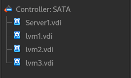
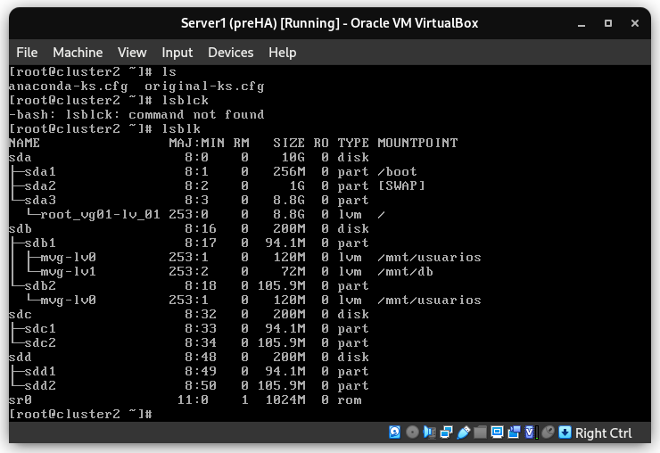

# P4. LVM
## Francesc Folch Company

- Primero añadimos volúmenes físicos desde el host de virtual box, los discos de "server1" quedarán de la siguiente manera:

- Después de crear las particiones para cada volumen físico tendremos la siguiente distribución:

- En la captura anterior se puede ver que ya se ha creado el grupo de particiones *mvg* y las particiones lógicas de *mvg* llamadas *lv0* y *lv1*, montadas en `/mnt/usuarios` y en `/mnt/db` respectivamente.

- Después se redimensionarán los volúmenes lógicos *lv0* y *lv1* (`lvextend`/`lvreduce`) y el sistema de archivos (`resize2fs`).

- También se pueden añadir volúmenes físicos a un grupo de volúmenes ya creado. Esto es interesante para modificar la capacidad de almacenamiento de un grupo que sirve una función específica de manera dinámica *on the fly*. 

- Si quisiéramos quitar un volumen que contiene datos, con la orden `pvmove` moveriamos los datos a otros volúmenes.

- Para crear una copia de seguridad se hará con la orden `lvcreate` con la opción `-s` (*snapshot*).