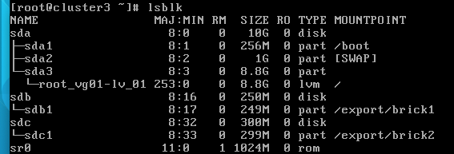
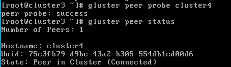
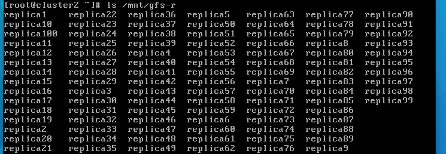
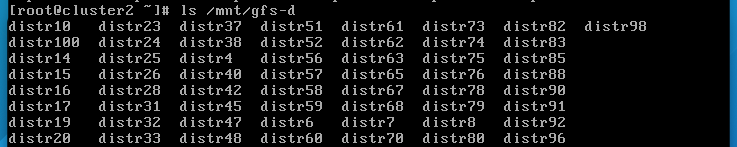

# P5. GlusterFS - COS
## Francesc Folch Company

Hemos creado una partición para cada volumnen (sdb y sdc) en cluster3 y cluster4.

Después emparejamos los dos nodos:

Con esto ya se pueden crear volumenes distribuidos y replicados entre cluster3 y cluster4, permitiendo la redundancia de datos y una mayor disponibilidad.

También se limita el acceso de los volumenes a la máquina cluster2, para mayor seguridad con el argumento auth.allow {ip}.

Por lo que podremos realizar las operaciones sobre los volúmenes gluster desde un solo nodo.

En este caso estas operaciones serán crear muchas copias de un archivo en el volumen replicado y en el volumen distribuido para observar las diferencias. Que, como se menciona en el boletín y es de esperar, en el volumen replicado se replicarán todas las copias para que cada máquina tenga una copia del archivo. Mientras que en el volumen distribuido, los archivos se repartirán entre las dos máquinas.

Esto lo podemos demostrar simulando la caida de cluster3, esto hará que desde cluster2 solo podamos acceder a la "mitad" de los archivos del volumen distribuido, pero a todos los archivos del volumen replicado, como se muestra en las capturas:

<em>Archivos del volumen replicado</em>

<em>Archivos del volumen distribuido</em>